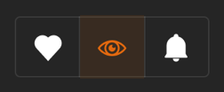

---

**Page Summary**

* [Specifications references](#specifications-references)
* [Accessibility](#accessibility)
* [Variants](#variants)
    * [Text button](#text-button)
    * [Outlined button](#outlined-button)
    * [Contained button](#contained-button)
    * [Toggle button](#toggle-button)
* [Component specific tokens](#component-specific-tokens)

---

## Specifications references

- [Design System Manager - Buttons](https://system.design.orange.com/0c1af118d/p/06a393-buttons/b/530521)
- [Material Design - Buttons](https://material.io/components/buttons/)
- Technical documentation soon available

## Accessibility

Please follow [accessibility criteria for development](https://a11y-guidelines.orange.com/en/mobile/android/development/)

Buttons support content labeling for accessibility and are readable by most screen readers, such as
TalkBack. Text rendered in buttons is automatically provided to accessibility services. Additional
content labels are usually unnecessary.

## Variants

### Text button

Text buttons are typically used for less-pronounced actions, including those located in dialogs and
cards. In cards, text buttons help maintain an emphasis on card content.

   

> **Jetpack Compose implementation**

Use the `OdsButtonText` composable:

```kotlin
OdsButtonText(
    text = "Text button", 
    onClick = {}, 
    enabled = true, 
    iconRes = R.drawable.ic_search // Optional, line can be removed if you don't need any icon
)
```

> **XML implementation**

To create a Text Button using Orange theme you will need to apply
style `@style/Widget.Orange.Button.Text` on your `Button` layout

In the layout:

```xml
<Button android:layout_width="wrap_content"
        android:layout_height="wrap_content"
        android:text="Text button"
        style="@style/Widget.Orange.Button.Text" />
```

To create a **Text Button having an icon** using Orange theme you will need to apply
style `@style/Widget.Orange.Button.Text.Icon` on your `Button` layout

```xml
<Button android:layout_width="wrap_content"
        android:layout_height="wrap_content"
        android:text="Text button with icon"
        app:icon="@drawable/ic_add_24dp"
        style="@style/Widget.Orange.Button.Text.Icon" />
```

### Outlined button

Outlined buttons are medium-emphasis buttons. They contain actions that are important, but aren’t
the primary action in an app.

   

> **Jetpack Compose implementation**

Use the `OdsButtonOutlined` composable:

```kotlin
OdsButtonOutlined(
    text = "Outlined button", 
    onClick = {}, 
    enabled = true,
    iconRes = R.drawable.ic_search // Optional, line can be removed if you don't need any icon
)
```

> **XML implementation**

To create an Outlined Button using Orange theme you will need to apply
style `@style/Widget.Orange.Button.Outlined` on your `Button` layout.

In the layout:

```xml
<Button android:layout_width="wrap_content"
        android:layout_height="wrap_content"
        android:text="Outlined button"
        style="@style/Widget.Orange.Button.Outlined" />
```

To create an **Outlined Button having an icon** using Orange theme you will need to apply
style `@style/Widget.Orange.Button.Outlined.Icon` on your `Button` layout.

```xml
<Button android:layout_width="wrap_content"
        android:layout_height="wrap_content"
        android:text="Outlined button with icon"
        app:icon="@drawable/ic_add_24dp"
        style="@style/Widget.Orange.Button.Outlined.Icon" />
```

### Contained button

Contained buttons are high-emphasis, distinguished by their use of elevation and fill. They contain
actions that are primary to your app.

   

Functional positive:

   

Functional negative:

   

> **Jetpack Compose implementation**

Use the `OdsButton` composable:

```kotlin
OdsButton(
    text = "Contained button", 
    onClick = {}, 
    enabled = true,
    iconRes = R.drawable.ic_search // Optional, line can be removed if you don't need any icon
)
```

To display a primary button or a functional green/red button, you need to pass a `functionalType` parameter:

```kotlin
OdsButton(
    text = "Positive button", 
    onClick = {}, 
    enabled = true,
    iconRes = R.drawable.ic_search, // Optional, line can be removed if you don't need any icon
    functionalType = OdsButtonFunctionalType.Positive
)
```


> **XML implementation**

_**Note** In XML, the contained button is the default style if the style is not set._

To create a Contained Button using Orange theme you will need to apply
style `@style/Widget.Orange.Button.Contained` on your `Button` layout

In the layout:

```xml
<Button android:layout_width="wrap_content"
        android:layout_height="wrap_content"
        android:text="Contained button"
        style="@style/Widget.Orange.Button.Contained" />
```

or

```xml
<Button android:layout_width="wrap_content"
        android:layout_height="wrap_content"
        android:text="Contained button" />
```

To create a **Contained Button having an icon** using Orange theme you will need to apply
style `@style/Widget.Orange.Button.Contained.Icon` on your `Button` layout

```xml
<Button android:layout_width="wrap_content"
        android:layout_height="wrap_content"
        android:text="Contained button with icon"
        app:icon="@drawable/ic_add_24dp"
        style="@style/Widget.Orange.Button.Contained.Icon" />
```


### Toggle button

To emphasize groups of related toggle buttons, a group should share a common container.

   

> **Jetpack Compose implementation**

Use the `OdsButtonToggle` composable:

```kotlin
OdsButtonToggle(
    checked = false, 
    onCheckedChange = { }, 
    iconRes = R.drawable.ic_search, 
    contentDescription = "action"
)
```

> **XML implementation**

API and source code:

* `MaterialButtonToggleGroup`: [Class description](https://developer.android.com/reference/com/google/android/material/button/MaterialButtonToggleGroup), [Class source](https://github.com/material-components/material-components-android/tree/master/lib/java/com/google/android/material/button/MaterialButtonToggleGroup.java)
* `MaterialButton`: [Class description](https://developer.android.com/reference/com/google/android/material/button/MaterialButton), [Class source](https://github.com/material-components/material-components-android/tree/master/lib/java/com/google/android/material/button/MaterialButton.java)

In the layout:

```xml
<com.google.android.material.button.MaterialButtonToggleGroup
        android:layout_width="wrap_content"
        android:layout_height="wrap_content">
    <Button android:layout_width="wrap_content"
            android:layout_height="wrap_content"
            android:text="Button 1"
            style="@style/Widget.Orange.Button.Outlined" />
    <Button android:layout_width="wrap_content"
            android:layout_height="wrap_content"
            android:text="Button 2"
            style="@style/Widget.Orange.Button.Outlined" />
    <Button android:layout_width="wrap_content"
            android:layout_height="wrap_content"
            android:text="Button 3"
            style="@style/Widget.Orange.Button.Outlined" />
</com.google.android.material.button.MaterialButtonToggleGroup>
```

To create an **icon-only toggle button** using Orange theme you will need to apply
style `@style/Widget.Orange.Button.Outlined.IconOnly` on your `Button` layout.

```xml
<com.google.android.material.button.MaterialButtonToggleGroup
        android:layout_width="wrap_content"
        android:layout_height="wrap_content">
  <Button android:layout_width="wrap_content"
          android:layout_height="wrap_content"
          android:text="Button 1"
          style="@style/Widget.Orange.Button.Outlined.IconOnly" />
  <Button android:layout_width="wrap_content"
          android:layout_height="wrap_content"
          android:text="Button 2"
          style="@style/Widget.Orange.Button.Outlined.IconOnly" />
  <Button android:layout_width="wrap_content"
          android:layout_height="wrap_content"
          android:text="Button 3"
          style="@style/Widget.Orange.Button.Outlined.IconOnly" />
</com.google.android.material.button.MaterialButtonToggleGroup>
```

## Component specific tokens

_Soon available_
