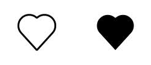

---

**Page Summary**

* [Specifications references](#specifications-references)
* [Accessibility](#accessibility)
* [Variants](#variants)
    * [Text button](#text-button)
    * [Outlined button](#outlined-button)
    * [Contained button](#contained-button)
    * [Icon button](#icon-button)
    * [Icon toggle button](#icon-toggle-button)
    * [Icon toggle buttons row](#icon-toggle-buttons-row)
* [Component specific tokens](#component-specific-tokens)

---

## Specifications references

- [Design System Manager - Buttons](https://system.design.orange.com/0c1af118d/p/06a393-buttons/b/530521)
- [Material Design - Buttons](https://material.io/components/buttons/)
- Technical documentation soon available

## Accessibility

Please follow [accessibility criteria for development](https://a11y-guidelines.orange.com/en/mobile/android/development/)

Buttons support content labeling for accessibility and are readable by most screen readers, such as
TalkBack. Text rendered in buttons is automatically provided to accessibility services. Additional
content labels are usually unnecessary.

## Variants

### Text button

Text buttons are typically used for less-pronounced actions, including those located in dialogs and
cards. In cards, text buttons help maintain an emphasis on card content.

 

> **Jetpack Compose implementation**

Use the `OdsTextButton` composable:

```kotlin
OdsTextButton(
    text = "Text button",
    onClick = {},
    enabled = true,
    icon = painterResource(R.drawable.ic_coffee), // Optional, line can be removed if you don't need any icon
    style = OdsTextButtonStyle.Primary
)
```

> **XML implementation**

To create a Text Button using Orange theme you will need to apply
style `@style/Widget.Orange.Button.Text` on your `Button` layout

In the layout:

```xml

<Button android:layout_width="wrap_content" android:layout_height="wrap_content"
    android:text="Text button" style="@style/Widget.Orange.Button.Text" />
```

To create a **Text Button having an icon** using Orange theme you will need to apply
style `@style/Widget.Orange.Button.Text.Icon` on your `Button` layout

```xml

<Button android:layout_width="wrap_content" android:layout_height="wrap_content"
    android:text="Text button with icon" app:icon="@drawable/ic_add_24dp"
    style="@style/Widget.Orange.Button.Text.Icon" />
```

### Outlined button

Outlined buttons are medium-emphasis buttons. They contain actions that are important, but aren’t
the primary action in an app.

 

> **Jetpack Compose implementation**

Use the `OdsOutlinedButton` composable:

```kotlin
OdsOutlinedButton(
    text = "Outlined button",
    onClick = {},
    enabled = true,
    icon = painterResource(R.drawable.ic_coffee) // Optional, line can be removed if you don't need any icon
)
```

> **XML implementation**

To create an Outlined Button using Orange theme you will need to apply
style `@style/Widget.Orange.Button.Outlined` on your `Button` layout.

In the layout:

```xml

<Button android:layout_width="wrap_content" android:layout_height="wrap_content"
    android:text="Outlined button" style="@style/Widget.Orange.Button.Outlined" />
```

To create an **Outlined Button having an icon** using Orange theme you will need to apply
style `@style/Widget.Orange.Button.Outlined.Icon` on your `Button` layout.

```xml

<Button android:layout_width="wrap_content" android:layout_height="wrap_content"
    android:text="Outlined button with icon" app:icon="@drawable/ic_add_24dp"
    style="@style/Widget.Orange.Button.Outlined.Icon" />
```

### Contained button

Contained buttons are high-emphasis, distinguished by their use of elevation and fill. They contain
actions that are primary to your app.

 

Functional positive:

 

Functional negative:

 

> **Jetpack Compose implementation**

Use the `OdsButton` composable:

```kotlin
OdsButton(
    text = "Contained button",
    onClick = {},
    enabled = true,
    icon = painterResource(R.drawable.ic_coffee) // Optional, line can be removed if you don't need any icon
)
```

To display a primary button or a functional green/red button, you need to pass an `OdsButtonStyle`
through the `style` parameter:

```kotlin
OdsButton(
    text = "Positive button",
    onClick = {},
    enabled = true,
    icon = painterResource(R.drawable.ic_coffee), // Optional, line can be removed if you don't need any icon
    style = OdsButtonStyle.FunctionalPositive
)
```

> **XML implementation**

_**Note** In XML, the contained button is the default style if the style is not set._

To create a Contained Button using Orange theme you will need to apply
style `@style/Widget.Orange.Button.Contained` on your `Button` layout

In the layout:

```xml

<Button android:layout_width="wrap_content" android:layout_height="wrap_content"
    android:text="Contained button" style="@style/Widget.Orange.Button.Contained" />
```

or

```xml

<Button android:layout_width="wrap_content" android:layout_height="wrap_content"
    android:text="Contained button" />
```

To create a **Contained Button having an icon** using Orange theme you will need to apply
style `@style/Widget.Orange.Button.Contained.Icon` on your `Button` layout

```xml

<Button android:layout_width="wrap_content" android:layout_height="wrap_content"
    android:text="Contained button with icon" app:icon="@drawable/ic_add_24dp"
    style="@style/Widget.Orange.Button.Contained.Icon" />
```

### Icon button

An icon button is a clickable icon, used to represent actions. This component is typically used
inside an App Bar for the navigation icon / actions.

 

> **Jetpack Compose implementation**

Use the `OdsIconButton` composable:

```kotlin
OdsIconButton(
    onClick = { },
    painter = painterResource(id = R.drawable.ic_ui_light_mode),
    contentDescription = stringResource(id = R.string.theme_changer_icon_content_description_light)
)
```

### Icon toggle button

An icon button with two states, for icons that can be toggled 'on' and 'off', such as a bookmark
icon, or a navigation icon that opens a drawer.

 

> **Jetpack Compose implementation**

Use the `OdsIconToggleButton` composable:

```kotlin
OdsIconToggleButton(
    checked = false,
    onCheckedChange = { },
    painter = painterResource(R.drawable.ic_heart_outlined),
    painterDescription = "Add to favourites",
    painterChecked = painterResource(R.drawable.ic_heart)
)
```

### Icon toggle buttons group

A group of toggle buttons. Only one option in a group of toggle buttons can be selected and active
at a time.
Selecting one option deselects any other.

 

> **Jetpack Compose implementation**

Use the `OdsIconToggleButtonsRow` composable:

```kotlin
OdsIconToggleButtonsRow(
    iconToggleButtons = listOf(
        OdsIconToggleButtonsRowItem(painterResource(id = R.drawable.ic_restaurant), "Restaurant"),
        OdsIconToggleButtonsRowItem(painterResource(id = R.drawable.ic_cooking_pot), "Cooking pot"),
        OdsIconToggleButtonsRowItem(painterResource(id = R.drawable.ic_coffee), "Coffee")
    ),
    selectedIndex = 0,
    onSelectedIndexChange = {
        // Do something like changing selectedIndex to refresh composable with new selection                        
    },
    displaySurface = displaySurface // Optional
)
```

> **XML implementation**

API and source code:

* `MaterialButtonToggleGroup`: [Class description](https://developer.android.com/reference/com/google/android/material/button/MaterialButtonToggleGroup)
  , [Class source](https://github.com/material-components/material-components-android/tree/master/lib/java/com/google/android/material/button/MaterialButtonToggleGroup.java)
* `MaterialButton`: [Class description](https://developer.android.com/reference/com/google/android/material/button/MaterialButton)
  , [Class source](https://github.com/material-components/material-components-android/tree/master/lib/java/com/google/android/material/button/MaterialButton.java)

In the layout:

```xml

<com.google.android.material.button.MaterialButtonToggleGroup android:layout_width="wrap_content"
    android:layout_height="wrap_content">
    <Button android:layout_width="wrap_content" android:layout_height="wrap_content"
        android:text="Button 1" style="@style/Widget.Orange.Button.Outlined" />
    <Button android:layout_width="wrap_content" android:layout_height="wrap_content"
        android:text="Button 2" style="@style/Widget.Orange.Button.Outlined" />
    <Button android:layout_width="wrap_content" android:layout_height="wrap_content"
        android:text="Button 3" style="@style/Widget.Orange.Button.Outlined" />
</com.google.android.material.button.MaterialButtonToggleGroup>
```

To create an **icon-only toggle button** using Orange theme you will need to apply
style `@style/Widget.Orange.Button.Outlined.IconOnly` on your `Button` layout.

```xml

<com.google.android.material.button.MaterialButtonToggleGroup android:layout_width="wrap_content"
    android:layout_height="wrap_content">
    <Button android:layout_width="wrap_content" android:layout_height="wrap_content"
        android:text="Button 1" style="@style/Widget.Orange.Button.Outlined.IconOnly" />
    <Button android:layout_width="wrap_content" android:layout_height="wrap_content"
        android:text="Button 2" style="@style/Widget.Orange.Button.Outlined.IconOnly" />
    <Button android:layout_width="wrap_content" android:layout_height="wrap_content"
        android:text="Button 3" style="@style/Widget.Orange.Button.Outlined.IconOnly" />
</com.google.android.material.button.MaterialButtonToggleGroup>
```

## Component specific tokens

_Soon available_
