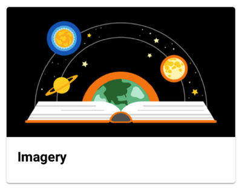
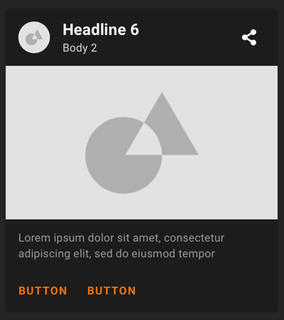

---

**Page Summary**

* [Specifications references](#specifications-references)
* [Accessibility](#accessibility)
* [Variants](#variants)
    * [Card image first](#card-image-first)
    * [Card title first](#card-title-first)
    * [Small card](#small-card)
* [Component specific tokens](#component-specific-tokens)

---

## Specifications references

- [Design System Manager - Cards](https://system.design.orange.com/0c1af118d/p/272739-cards/b/991690)
- [Material Design - Cards](https://material.io/components/cards/)
- Technical documentation soon available

## Accessibility

Please follow [accessibility criteria for development](https://a11y-guidelines.orange.com/en/mobile/android/development/)

The contents within a card should follow their own accessibility guidelines, such as images having content descriptions set on them.

If you have a draggable card, you should set an
[`AccessibilityDelegate`](https://developer.android.com/reference/android/view/View.AccessibilityDelegate)
on it, so that the behavior can be accessible via screen readers such as TalkBack.  
See the [draggable card section](https://material.io/components/cards/android#making-a-card-draggable) section for more info.

## Variants

The library offers several Composables for Jetpack Compose implementation. In XML, the library is only styling `MaterialCardView`.

### Card image first

This is a full width card displayed with an image as first element.

   

> **Jetpack Compose implementation**

In your composable screen you can use `OdsImageFirstCard` composable:

```kotlin
OdsImageFirstCard(
    title = "Title",
    image = painterResource(R.drawable.picture),
    imageContentDescription = "Picture content description", //Optional
    imageBackgroundColor = Color(0xff1b1b1b), //Optional
    imageContentScale = ContentScale.Crop,
    imageAlignment = Alignment.Center,
    subtitle = "Subtitle", //Optional
    text = "Text", //Optional
    button1Text = "Button1", //Optional
    button2Text = "Button2", //Optional
    onCardClick = {  }, //Optional
    onButton1Click = {  }, //Optional
    onButton2Click = {  } //Optional
)
```

> **XML implementation**

See [Cards implementation in XML](#cards-implementation-in-xml)

### Card title first

This is a full width card displaying with a title and a thumbnail on top as first element.

   

> **Jetpack Compose implementation**

In your composable screen you can use `OdsTitleFirstCard`composable:

```kotlin
OdsTitleFirstCard(
    title = "Title",
    image = painterResource(R.drawable.picture),
    thumbnail = painterResource(R.drawable.thumbnail), //Optional
    subtitle = "Subtitle", //Optional
    imageContentDescription = "Picture content description", //Optional
    imageBackgroundColor = Color(0xff1b1b1b), //Optional
    imageContentScale = ContentScale.Crop,
    imageAlignment = Alignment.Center,
    text = "Text", //Optional
    button1Text = "Button1", //Optional
    button2Text = "Button2", //Optional
    onCardClick = {  }, //Optional
    onButton1Click = {  }, //Optional
    onButton2Click = {  } //Optional
)
```

> **XML implementation**

See [Cards implementation in XML](#cards-implementation-in-xml)

### Small card

This is a small card which takes the half screen width.

   

> **Jetpack Compose implementation**

You can add an `OdsSmallCard`composable in your screen to add a small card:

```kotlin
Row(
    horizontalArrangement = Arrangement.spacedBy(16.dp),
) {
    OdsSmallCard(
        title = "Title",
        image = painterResource(R.drawable.picture),
        modifier = Modifier.weight(0.5f),
        onCardClick = {}
    )
    OdsSmallCard(
        title = "Title",
        image = painterResource(R.drawable.picture),
        modifier = Modifier.weight(0.5f),
        onCardClick = {}
    )
}
```

> **XML implementation**

See [Cards implementation in XML](#cards-implementation-in-xml)

### Cards implementation in XML

To have a Card in your layout you must add `com.google.android.material.card.MaterialCardView` in your layout.

API and source code:

*   `MaterialCardView`: [Class definition](https://developer.android.com/reference/com/google/android/material/card/MaterialCardView), [Class source](https://github.com/material-components/material-components-android/tree/master/lib/java/com/google/android/material/card/MaterialCardView.java)

In the layout:

```xml
<com.google.android.material.card.MaterialCardView
    android:id="@+id/card"
    android:layout_width="match_parent"
    android:layout_height="wrap_content"
    android:layout_margin="8dp">

    <LinearLayout
        android:layout_width="match_parent"
        android:layout_height="wrap_content"
        android:orientation="vertical">

        <!-- Media -->
        <ImageView
            android:layout_width="match_parent"
            android:layout_height="194dp"
            app:srcCompat="@drawable/media"
            android:scaleType="centerCrop"
            android:contentDescription="@string/content_description_media"
            />

        <LinearLayout
            android:layout_width="match_parent"
            android:layout_height="wrap_content"
            android:orientation="vertical"
            android:padding="16dp">

            <!-- Title, secondary and supporting text -->
            <TextView
                android:layout_width="wrap_content"
                android:layout_height="wrap_content"
                android:text="@string/title"
                android:textAppearance="?attr/textAppearanceHeadline6"
                />
            <TextView
                android:layout_width="wrap_content"
                android:layout_height="wrap_content"
                android:layout_marginTop="8dp"
                android:text="@string/secondary_text"
                android:textAppearance="?attr/textAppearanceBody2"
                android:textColor="?android:attr/textColorSecondary"
                />
            <TextView
                android:layout_width="wrap_content"
                android:layout_height="wrap_content"
                android:layout_marginTop="16dp"
                android:text="@string/supporting_text"
                android:textAppearance="?attr/textAppearanceBody2"
                android:textColor="?android:attr/textColorSecondary"
                />

        </LinearLayout>

        <!-- Buttons -->
        <LinearLayout
            android:layout_width="wrap_content"
            android:layout_height="wrap_content"
            android:layout_margin="8dp"
            android:orientation="horizontal">
            <com.google.android.material.button.MaterialButton
                android:layout_width="wrap_content"
                android:layout_height="wrap_content"
                android:layout_marginEnd="8dp"
                android:text="@string/action_1"
                style="@style/Widget.Orange.Button.Text"
                />
            <com.google.android.material.button.MaterialButton
                android:layout_width="wrap_content"
                android:layout_height="wrap_content"
                android:text="@string/action_2"
                style="@style/Widget.Orange.Button.Text"
                />
        </LinearLayout>

    </LinearLayout>

</com.google.android.material.card.MaterialCardView>
```

## Component specific tokens

_Soon available_
