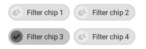
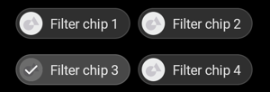

---

**Page summary**

* [Specifications references](#specifications-references)
* [Accessibility](#accessibility)
* [Variants](#variants)
  * [Input chip](#input-chip)
  * [Choice chip](#choice-chip)
  * [Filter chip](#filter-chip)
  * [Action chip](#action-chip)
* [Component specific tokens](#component-specific-tokens)

---

## Specifications references

- [Design System Manager](https://system.design.orange.com/0c1af118d/p/81aa91-chips/b/13c40e)
- [Material Design](https://material.io/components/chips)
- Technical documentation soon available

## Accessibility

Please follow [accessibility criteria for development](https://a11y-guidelines.orange.com/en/mobile/android/development/)

Chips support content labeling for accessibility and are readable by most screen readers, such as
TalkBack. Text rendered in chips is automatically provided to accessibility services. Additional
content labels are usually unnecessary.

## Variants

### Input chip

Input chips (referred to as **entry** chips in Android) represent a complex piece of information in
compact form, such as an entity (person, place, or thing) or text. They enable user input and verify
that input by converting text into chips.

   

   

> **Jetpack Compose implementation**

Use the `OdsChip` composable:

```kotlin
OdsChip(
    text = "chip text",
    onClick = {
        // Something executed on chip click
    },
    outlined = false, // Set it to `true` to display an outlined chip
    leadingAvatar = painterResource(id = R.drawable.avatar),
    enabled = true, // Set it to `false` to disabled the chip
    onCancel = { 
        // Something executed on cancel cross click
    }
)
```

> **XML implementation**

To create an input chip you must add a `com.google.android.material.chip.Chip` component to your
layout and set `style` property to `@style/Widget.MaterialComponents.Chip.Entry`

In the layout:

```xml

<com.google.android.material.chip.ChipGroup>
    <com.google.android.material.chip.Chip 
        android:id="@+id/chip_1"
        style="@style/Widget.MaterialComponents.Chip.Entry"
        android:layout_width="wrap_content"
        android:layout_height="wrap_content" 
        android:text="@string/text_input_1" />

</com.google.android.material.chip.ChipGroup>
```

### Choice chip

Choice chips allow selection of a single chip from a set of options.

Choice chips clearly delineate and display options in a compact area. They are a good alternative to
toggle buttons, radio buttons, and single select menus.

   

   

> **Jetpack Compose implementation**

Use the `OdsChip` composable:

```kotlin
OdsChip(
    text = "chip text",
    onClick = {
        // Something executed on chip click
    },
    outlined = false, // Set it to `true` to display an outlined chip
    enabled = true, // Set it to `false` to disabled the chip
)
```

> **XML implementation**

To create a choice chip you must add a `com.google.android.material.chip.Chip` component to your
layout and set `style` property to `@style/Widget.MaterialComponents.Chip.Choice`

In the layout:

```xml

<com.google.android.material.chip.ChipGroup...>
    <com.google.android.material.chip.Chip
        android:id="@+id/chip_1"
        style="@style/Widget.MaterialComponents.Chip.Choice"
        android:layout_width="wrap_content" 
        android:layout_height="wrap_content"
        android:text="@string/text_choice_1" />

    </com.google.android.material.chip.ChipGroup>
```

### Filter chip

Filter chips use tags or descriptive words to filter content.

Filter chips clearly delineate and display options in a compact area. They are a good alternative to
toggle buttons or checkboxes.

   

   

> **Jetpack Compose implementation**

Use the `OdsFilterChip` composable:

```kotlin
OdsFilterChip(
    text = "chip text",
    onClick = {
        // Something executed on chip click
    },
    leadingAvatar = painterResource(id = R.drawable.avatar), // set it to `null` for no avatar
    onClick = { 
         // Something executed on chip click
    },
    selected = false, // `true` to display the chip selected
    outlined = false, // Set it to `true` to display an outlined chip
    enabled = true, // Set it to `false` to disabled the chip
)
```

> **XML implementation**

To create a filter chip you must add a `com.google.android.material.chip.Chip` component to your
layout and set `style` property to `@style/Widget.MaterialComponents.Chip.Filter`

In the layout:

```xml
<com.google.android.material.chip.ChipGroup...>
    <com.google.android.material.chip.Chip
        android:id="@+id/chip_1"
        style="@style/Widget.MaterialComponents.Chip.Filter"
        android:layout_width="wrap_content"
        android:layout_height="wrap_content"
        android:text="@string/text_choice_1" />

</com.google.android.material.chip.ChipGroup>
```

### Action chip

Action chips offer actions related to primary content. They should appear dynamically and
contextually in a UI.

An alternative to action chips are buttons, which should appear persistently and consistently.

   

   

> **Jetpack Compose implementation**

Use the `OdsChip` composable:

```kotlin
OdsChip(
    text = "chip text",
    onClick = {
        // Something executed on chip click
    },
    leadingIcon = painterResource(id = R.drawable.ic_heart), // set it to `null` for no icon
    outlined = false, // Set it to `true` to display an outlined chip
    enabled = true, // Set it to `false` to disabled the chip
)
```

> **XML implementation**

To create an action chip you must add a `com.google.android.material.chip.Chip` component to your
layout and set `style` property to `@style/Widget.MaterialComponents.Chip.Action`

In the layout:

```xml

<com.google.android.material.chip.ChipGroup...>
    <com.google.android.material.chip.Chip
        android:id="@+id/chip_1"
        style="@style/Widget.MaterialComponents.Chip.Action"
        android:layout_width="wrap_content"
        android:layout_height="wrap_content"
        android:text="@string/text_choice_1" />

</com.google.android.material.chip.ChipGroup>
```

## Component specific tokens

_Soon available_
