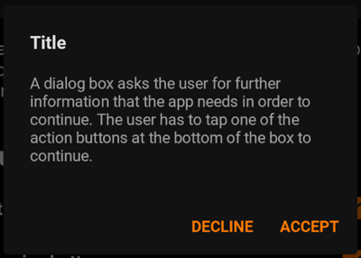

**Page Summary**

* [Specifications references](#specifications-references)
* [Accessibility](#accessibility)
* [Variants](#variants)
    * [Alert dialog](#alert-dialog)
    * [Simple dialog](#simple-dialog)
* [Component specific tokens](#component-specific-tokens)


A dialog is a type of modal window that appears in front of app content to
provide critical information or ask for a decision. Dialogs disable all app
functionality when they appear, and remain on screen until confirmed, dismissed,
or a required action has been taken.

Dialogs are purposefully interruptive, so they should be used sparingly.

## Specifications references

- [Design System Manager - Dialogs](https://system.design.orange.com/0c1af118d/p/02ae02-dialogs/b/81772e)
- [Material Design - Dialogs](https://material.io/components/dialogs)
- Technical documentation soon available

## Accessibility

Please follow [accessibility criteria for development](https://a11y-guidelines.orange.com/en/mobile/android/development/)

The contents within a dialog should follow their own accessibility guidelines,
such as an icon on a title having a content description via the
`android:contentDescription` attribute set in the
`MaterialAlertDialog.MaterialComponents.Title.Icon` style or descendant.

## Variants

### Alert dialog

Alert dialogs interrupt users with urgent information, details, or actions.

    

> **Jetpack Compose implementation**

To display an alert dialog in your composable screen, you can use:

```kotlin
OdsAlertDialog(
    modifier = Modifier, // Optional, `Modifier` if not set
    titleText = "title", // Optional
    text = "content text of the dialog",
    confirmButtonText = "confirm",
    onConfirmButtonClick = { doSomething() },
    dismissButtonText = "dismiss", // Optional
    onDismissButtonClick = { doSomething() }, // Optional
    properties = DialogProperties() // Optional, `DialogProperties()` if not set
)
```

> **XML implementation**

In code:

```kotlin
MaterialAlertDialogBuilder(context)
        .setTitle(resources.getString(R.string.title))
        .setMessage(resources.getString(R.string.supporting_text))
        .setNeutralButton(resources.getString(R.string.cancel)) { dialog, which ->
            // Respond to neutral button press
        }
        .setNegativeButton(resources.getString(R.string.decline)) { dialog, which ->
            // Respond to negative button press
        }
        .setPositiveButton(resources.getString(R.string.accept)) { dialog, which ->
            // Respond to positive button press
        }
        .show()
```

Centered dialog:

```kotlin
MaterialAlertDialogBuilder(context, R.style.Widget.Orange.Dialog.Centered)
        .setTitle("title")
        .setMessage("message")
        .setPositiveButton("positiveText", null)
        .setNegativeButton("negativeText", null)
        .setIcon(R.drawable.your_drawable)
        .show()
```

### Simple dialog

Simple dialogs can display items that are immediately actionable when selected.
They don’t have text buttons.

As simple dialogs are interruptive, they should be used sparingly.
Alternatively, dropdown menus provide options in a non-modal, less disruptive
way.

> **Jetpack Compose implementation**

*Not available yet*

> **XML implementation**

In code:

```kotlin
val items = arrayOf("Item 1", "Item 2", "Item 3")

MaterialAlertDialogBuilder(context)
        .setTitle(resources.getString(R.string.title))
        .setItems(items) { dialog, which ->
             // Respond to item chosen
         }
        .show()
```

## Component specific tokens

_Soon available_
