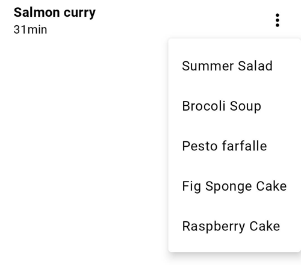
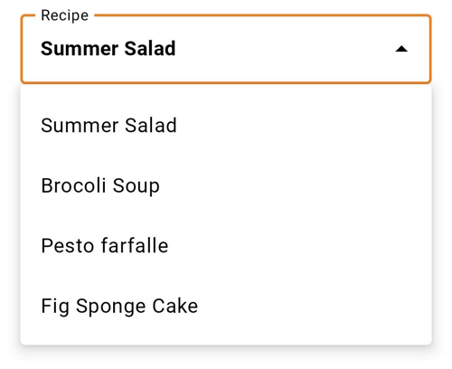
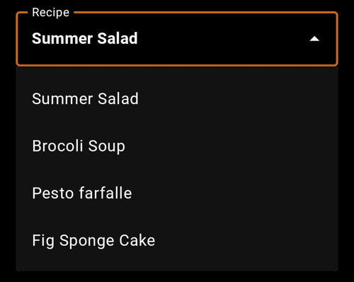

<br>**On this page**

* [Specifications references](#specifications-references)
* [Accessibility](#accessibility)
* [Variants](#variants)
    * [Dropdown menu](#dropdown-menu)
        * [Jetpack Compose](#jetpack-compose)
            * [OdsDropdownMenu API](#odsdropdownmenu-api)
    * [Exposed dropdown menu](#exposed-dropdown-menu)
        * [Jetpack Compose](#jetpack-compose-1)
            * [OdsExposedDropdownMenu API](#odsexposeddropdownmenu-api)

---

## Specifications references

- [Design System Manager - Menus](https://system.design.orange.com/0c1af118d/p/07a69b-menus/b/862cbb)
- [Material Design - Menus](https://m2.material.io/components/menus)

## Accessibility

Please follow [accessibility criteria for development](https://a11y-guidelines.orange.com/en/mobile/android/development/)

The icons which can be displayed in a dropdown menu are always associated to a text so they don't need a content description.

## Variants

### Dropdown menu

A dropdown menu is a compact way of displaying multiple choices. It appears upon interaction with an element (such as an icon or button) or when users perform a specific action.

 

#### Jetpack Compose

The library offers an `OdsDropdownMenu` container composable in which you can add `OdsDropdownMenuItem` or `OdsDivider` as shown in the following example:

```kotlin
var menuExpanded by remember { mutableStateOf(false) }

OdsDropdownMenu(
    expanded = menuExpanded,
    onDismissRequest = { menuExpanded = false },
    offset = DpOffset(x = (-100).dp, y = (-10).dp),
    items = listOf(
        OdsDropdownMenuItem(
            text = "Summer salad",
            icon = painterResource(id = R.drawable.ic_salad),
            divider = true, // Allow to add a divider between the 2 items
            onClick = { doSomething() }
        ),
        OdsDropdownMenuItem(
            text = "Brocoli soup",
            icon = painterResource(id = R.drawable.ic_soup),
            onClick = { doSomething() }
        )
    )
)
```

##### OdsDropdownMenu API

Parameter | Default&nbsp;value | Description
-- | -- | --
`items: List<OdsDropdownMenuItem>` | | Items displayed into the dropdown menu
`expanded: Boolean` | | Controls whether the menu is currently open and visible to the user
`onDismissRequest: () -> Unit` | | Callback invoked when the user requests to dismiss the menu, such as by tapping outside the menu's bounds
`modifier: Modifier` | `Modifier` | `Modifier` applied to the dropdown menu
`offset: DpOffset` | `DpOffset(0.dp, 0.dp)` | Offset added to the menu position
`properties: PopupProperties` | `PopupProperties(focusable = true)` | Properties for further customization of the popup's behavior
{:.table}

### Exposed dropdown menu

Exposed dropdown menus display the currently selected menu item above the menu. This is a combination of a text field and a menu.

  

#### Jetpack Compose

To display an exposed dropdown menu, you can use the `OdsExposedDropdownMenu` composable. As shown below, you should provide a list of `OdsExposedDropdownMenuItem` corresponding to the items displayed in the menu (with or without icons).

```kotlin
val items = listOf(
    OdsExposedDropdownMenuItem("Email", android.R.drawable.ic_dialog_email),
    OdsExposedDropdownMenuItem("Map", android.R.drawable.ic_dialog_map),
    OdsExposedDropdownMenuItem("Dialer", android.R.drawable.ic_dialog_dialer),
)
val selectedItem = rememberSaveable() { mutableStateOf(items.first()) }

OdsExposedDropdownMenu(
    label = "Dropdown menu label",
    items = items,
    selectedItem = selectedItem,
    onItemSelectionChange = { item ->
        doSomething() // Do something like retrieving the selected item
    },
    enabled = true
)
```

##### OdsExposedDropdownMenu API

Parameter | Default&nbsp;value | Description
-- | -- | --
`label: String` | | Label of the exposed menu text field
`items: List<OdsExposedDropdownMenuItem>` | | Items displayed into the dropdown menu
`selectedItem: MutableState<OdsExposedDropdownMenuItem>` | | Selected item displayed into the text field
`onItemSelectionChange: (OdsExposedDropdownMenuItem) -> Unit` | | Callback invoked when a dropdown menu item is selected. It can be used to get the menu value.
`modifier: Modifier` | `Modifier` | `Modifier` applied to the dropdown menu
`enabled: Boolean` | `true` | Controls the enabled state of the dropdown menu. When `false`, the dropdown menu text field will be neither clickable nor focusable, visually it will appear in the disabled state.
{:.table}
