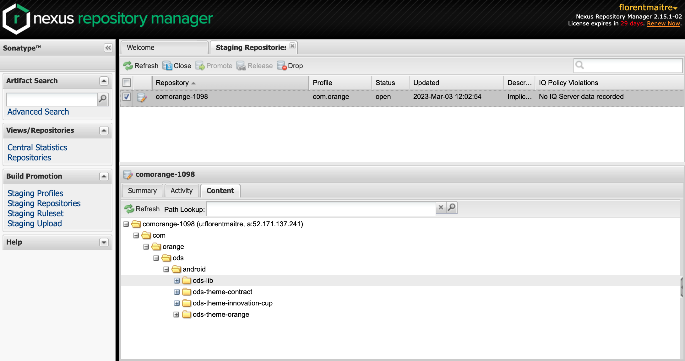
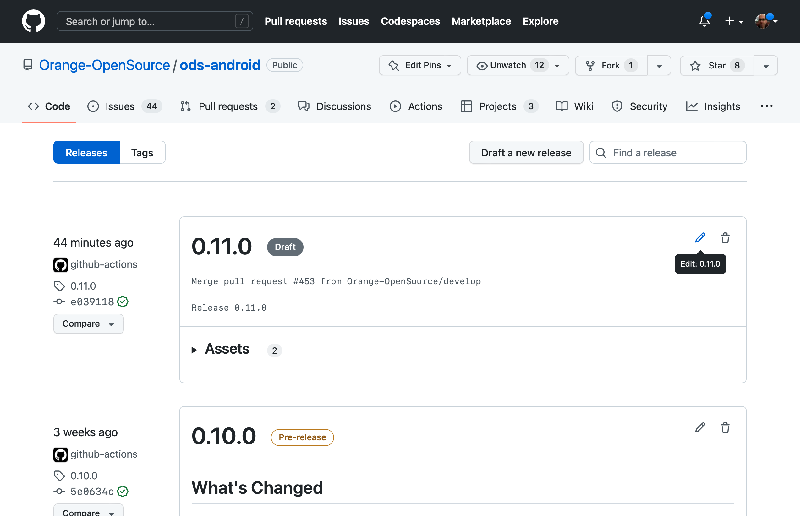

# ODS Android release guide

This file lists all the steps to follow when releasing a new version of ODS Android.

- [Prepare release](#prepare-release)
- [Release](#release)
  * [Publish release to Maven Central](#publish-release-to-maven-central)
  * [Publish release to GitHub](#publish-release-to-github)
  * [Upload APK to Firebase App Distribution](#upload-apk-to-firebase-app-distribution)<br /><br />

## Prepare release

- Create a new issue on GitHub to prepare the new release for ODS Android version X.Y.Z.

- Create a branch for this issue.

- Switch to this branch and launch the `prepareRelease` Gradle task:

    ```shell
    ./gradlew prepareRelease -Pversion=X.Y.Z
    ```

    This task performs the following changes to the project:
    
    - Update `version` project property in `gradle.properties`.
    - Update version of ODS Android dependencies in various Markdown files.
    - Update the changelog.
    - Archive the documentation in `docs/X.Y.Z`.
    - Update Jekyll configuration files.<br /><br />

- Verify the changes mentioned above, then commit and push.

    Please note that you have to launch the following commands from the `docs` folder to build and verify the documentation:

    ```shell
    bundle install
    ```
    ```shell
    bundle exec jekyll server --trace
    ```
    
    Once the Jekyll server is started, the documentation for version X.Y.Z should be available at http://127.0.0.1:4000/ods-android/X.Y.Z/.

- Create a new pull request on GitHub to merge your branch into `develop`.

- Review and merge this pull request on GitHub.<br /><br />

## Release

- Create a new pull request on GitHub to merge `develop` into `master`.

- Review and merge this pull request on GitHub.

- Switch to the latest master commit and launch the `tagRelease` Gradle task:

    ```shell
    ./gradlew tagRelease
    ```

    This task adds an `X.Y.Z` tag and push it to the remote repository.<br /><br />

### Publish release to Maven Central

- Go to [GitHub Actions](https://github.com/Orange-OpenSource/ods-android/actions) and open the workflow launched by the tag creation.

- Click `Review deployments`, select `maven-central-release` and click `Approve and deploy`.

    

- Go to [Sonatype Nexus Repository Manager](https://oss.sonatype.org).

- Go to `Staging Repositories`.

- Verify the content of the ODS Android repository.

    

- Click `Close` if content is OK or `Drop` otherwise.

- Retrieve the Sonatype repository ID from either the repository name or URL.

    

- Launch the `testSonatypeRepository` Gradle task using the ID from the previous step:

    ```shell
    ./gradlew testSonatypeRepository -PsonatypeRepositoryId=<repository_id>
    ```

    This task allows you to test the release before it is deployed to Maven Central and performs the following changes to the project:
    
    - Add Sonatype Maven repository.
    - Remove all Android Studio modules except `demo`.
    - Replace project dependencies with module dependencies in `demo`.<br /><br />

- Synchronize Gradle, build app, deploy and test on device.

- Go back to Sonatype Nexus Repository Manager and click `Release`.<br /><br />

### Publish release to GitHub

- Go to [GitHub Actions](https://github.com/Orange-OpenSource/ods-android/actions), click `Review deployments`, select `github-release` and click `Approve and deploy`.

- Go to [GitHub Releases](https://github.com/Orange-OpenSource/ods-android/releases).

- Edit the new release draft.

    

- Set previous tag and click `Generate release notes` to automatically generate the release notes.

    

- Verify the release notes using the preview tab.

- Optionally check `Set as a pre-release` and click `Publish release`.<br /><br />

### Upload APK to Firebase App Distribution

- Go to [GitHub Actions](https://github.com/Orange-OpenSource/ods-android/actions), click `Review deployments`, select `app-distribution-release` and click `Approve and deploy`.

- Test release APK using `Firebase App Tester` app.
